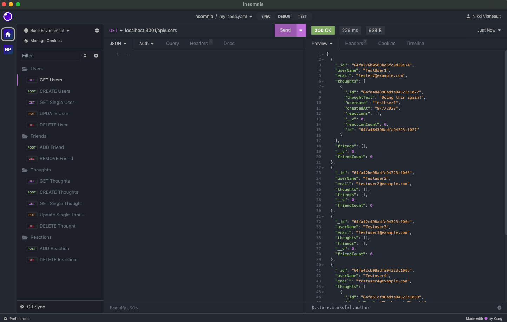
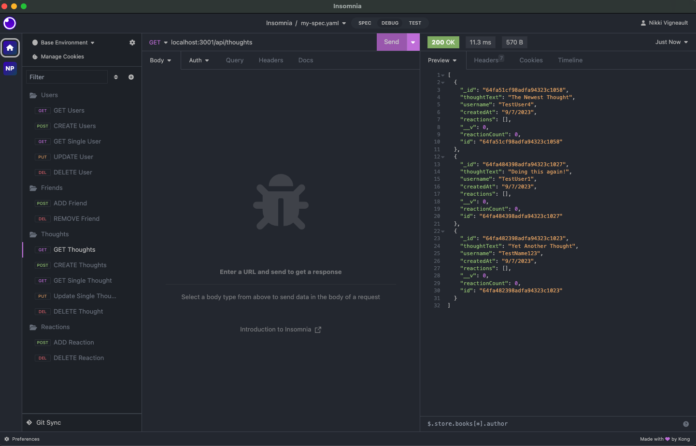

# Social Network Api - Challenge 18

## Project Description

This Backend Social Network API uses MongoDB and has the functionality to create, update and delete users, add friends and update the users with thoughts and reactions which can be seen in a video using Insomnia. 

## Challenges

While using mongoDB is technically easier than using MySql this challenge was quite large and I found as I was going through keeping track of the information I needed to convey was getting harder and harder ending with a lot of error codes that needed resolving. By the end of this assignmnet though I feel that I am much more prepared for database work. 

## Examples

## Walkthough

Please watch the walkthough [here](https://drive.google.com/file/d/1w7-9_Jb8r5rQ0rz56fQk-4NDjL_0ooFa/view?usp=sharing)

## Questions

to reach out to me or check out more of my work you can find my profile [here](https://github.com/nikkivno)

